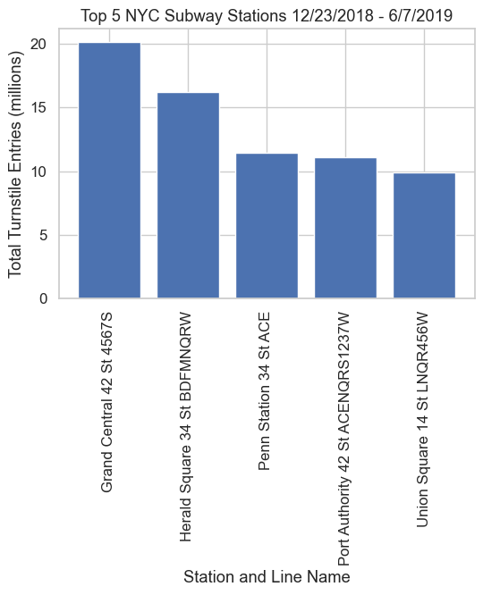
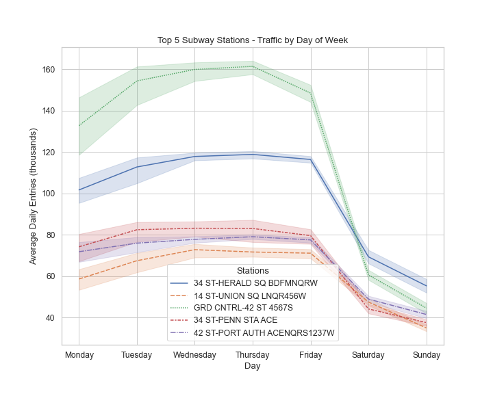
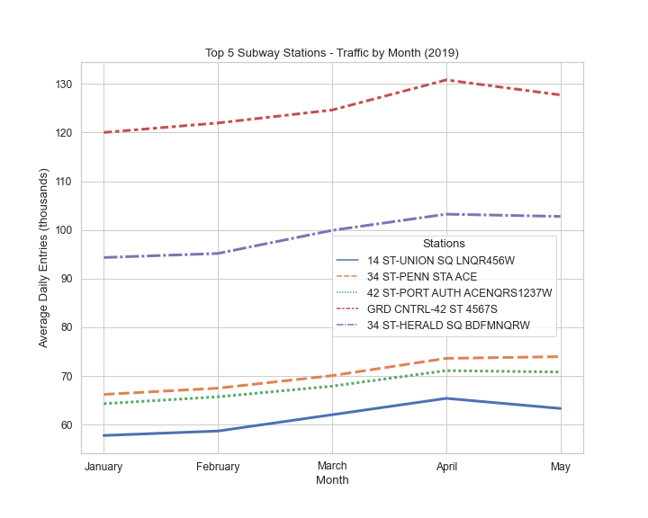

# WomenTechWomenYes MTA Traffic Analysis

### Goal
The goal of this exploratory data analysis project is to offer guidance to WomenTechWomenYes on the best locations to place their street teams for promotion of the next summer gala.

### Preliminary Analysis
Turnstile entry data from the beginning of 2019 was used since it is expected to be the most recent time period that accurately represents traffic in 2022. 2020 and 2021 saw large reductions in traffic in the early part of each year due to the COVID-19 pandemic. The first half of the year is being used because the gala is planned for the beginning of summer, so promotional efforts will fall in this time period.

The train stations with the highest traffic are shown below:

Preliminary analysis shows that these are the stations which should be targeted for promotional activities to reach the largest number of potential participants.

Those top five stations all show a decrease in traffic over the weekend:

This suggests that street teams should promote during weekdays.

The monthly trend of traffic shows an increase in traffic at the beginning of spring:

The analysis completed to this point suggests that Penn Station, Grand Central Station, Herald Square, 23rd Street, and Union Square should be the focus of promotion efforts. Weekdays would be best. Additional traffic seen at the beginning of spring may be of help to promotional efforts, but may also simply be an indication of increased tourism, which would not be particularly helpful to WTWY.

### Further Analysis
The time of day to promote has not yet been evaluated. Also, demographic data was not considered in this preliminary analysis. These are two areas where future efforts will be focused. Additional turnstile entry data from other time periods may also be considered.